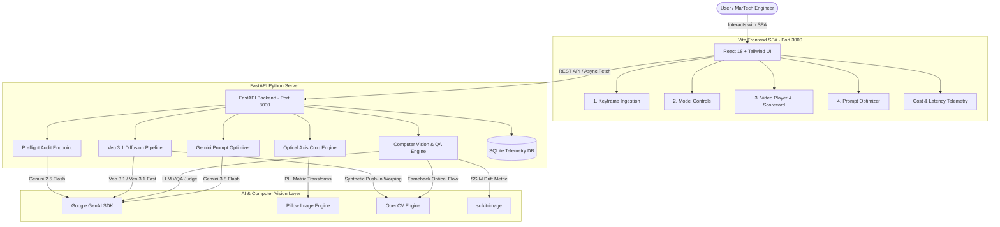

# VeoBench | Expedia Group MarTech Generative Media Evaluation Platform

[](https://fastapi.tiangolo.com)
[](https://reactjs.org)
[](https://vitejs.dev)
[](https://tailwindcss.com)
[](https://python.org)
[](https://cloud.google.com/vertex-ai)
[](https://opencv.org)

**VeoBench** is a production-grade **Generative Media Evaluation & Model Certification Platform** built for enterprise Marketing Technology (MarTech) teams at global travel brands like Expedia Group. The platform benchmarks, evaluates, and certifies Google generative media models (**Veo 3.1**, **Veo 3.1 Fast**, **Veo 3.1 Lite**) on real-world hospitality photography using strict mechanical API levers, automated computer vision metrics, LLM-as-a-Judge visual quality assessments, and granular API cost/latency telemetry.

---

## 📋 Table of Contents

- [Overview & Architecture](#-overview--architecture)
- [Core Benchmarking Workflow](#-core-benchmarking-workflow)
  - [Section 1: Keyframe Conditioning & Preflight Audit](#section-1-keyframe-conditioning--preflight-audit)
  - [Section 2: Mechanical Model Controls](#section-2-mechanical-model-controls)
  - [Section 3: Output Video Player & Quality Scorecard](#section-3-output-video-player--quality-scorecard)
  - [Section 4: Closed-Loop AI Prompt Optimizer](#section-4-closed-loop-ai-prompt-optimizer)
  - [Tab 2: Cost & Latency Analytics](#tab-2-cost--latency-analytics)
- [Tech Stack](#-tech-stack)
- [Repository File Structure](#-repository-file-structure)
- [Prerequisites](#-prerequisites)
- [Quickstart & Installation Guide](#-quickstart--installation-guide)
  - [1. Backend Setup (FastAPI)](#1-backend-setup-fastapi)
  - [2. Frontend Setup (React SPA)](#2-frontend-setup-react-spa)
- [Execution Modes: Mock vs. Live Vertex AI](#-execution-modes-mock-vs-live-vertex-ai)
- [API Reference](#-api-reference)
- [Automated Testing & Verification](#-automated-testing--verification)
- [Export & Report Generation](#-export--report-generation)
- [License & Enterprise Support](#-license--support)

---

## 🏗️ Overview & Architecture

VeoBench bridges the gap between raw video diffusion models and production MarTech media certification. It provides brand managers and AI engineers with a quantitative, reproducible framework to verify that AI-generated video clips adhere to brand safety guidelines, exhibit zero structural morphing, and maintain rigid camera optics.

### System Architecture Diagram



---

## 💡 Core Benchmarking Workflow

VeoBench organizes media benchmarking into a streamlined, 4-step linear pipeline with real-time feedback and closed-loop optimization.

```
┌─────────────────────────────────────────────────────────────────────────────────────────┐
│ 1. Keyframe Ingestion ──► 2. Model Controls ──► 3. Quality Scorecard ──► 4. AI Optimizer │
└─────────────────────────────────────────────────────────────────────────────────────────┘
```

### Section 1: Keyframe Conditioning & Preflight Audit
- **Hospitality Sample Gallery**: Includes 5 pre-loaded high-resolution keyframe photos covering key hotel asset classes: *Interior Suite*, *Pool/Waterfront*, *Exterior Facade*, *Lobby/Lounge*, and *Dining/Restaurant*.
- **Custom Image Upload**: Drag-and-drop support for custom 1080p hotel keyframe photography.
- **Automated Preflight Audit**: Invokes **Gemini 2.5 Flash** to analyze keyframe metadata, minimum resolution (1080p verification), brand compliance, watermarks, face safety, and skin/swimwear exposure.
- **Optical Axis Push-In Generator**: An interactive 3% to 15% depth slider that generates a synthetic end-frame (`last_frame`) conditioned along the camera's optical z-axis.

### Section 2: Mechanical Model Controls
Provides full parameter control over Google Veo video diffusion models:
- **Model Variant Selector**: `veo-3.1-fast-generate-001` (Default), `veo-3.1-generate-001` (Standard), `veo-3.1-lite-generate-001`, `veo-3.0-generate-001`, and legacy `veo-2.0`.
- **Resolution**: `720p` or `1080p`.
- **Duration**: Slider from `3.0s` to `8.0s` in 0.5s increments.
- **Aspect Ratio**: `16:9` (Landscape), `9:16` (Vertical/Reels), `1:1` (Square).
- **Seed Control**: Number input with Randomize button and Lock/Unlock toggle for reproducible generation experiments.
- **Directorial Camera Prompt**: Natural language camera movement directive (e.g., *"The camera performs a smooth, linear push-in dolly shot toward the horizon..."*).
- **Dedicated Negative Constraints**: Anti-morphing safeguard prompt preventing lateral pan, rotational roll, tilt, wall morphing, and phantom figures.
- **Prompt Expansion Toggle**: Controls model prompt rewriter behavior to prevent erratic camera movements.
- **Conditioning Toggles**: `last_frame` end-frame conditioning toggle, Person Generation settings (`dont_allow`, `allow_adult`, `allow_all`), and Safety Threshold modes (`BLOCK_ONLY_HIGH`, `BLOCK_MEDIUM_AND_ABOVE`).

### Section 3: Output Video Player & Quality Scorecard
- **Dual-Video Player**: Displays keyframe image side-by-side with generated 4-second MP4 video clip, complete with looping controls, resolution tags, and frame counts (120 frames at 30 fps).
- **Certification Badge**: Real-time certification status banner (**CERTIFIED**, **WARNED**, **REJECTED**) based on composite QA thresholds.
- **Automated Computer Vision Metrics**:
  - **Structural Drift (SSIM)**: Uses `scikit-image` SSIM to evaluate structural preservation between initial frame and video sequence. Color-coded: **Green (≥0.82)**, **Yellow (0.75 - 0.81)**, **Red (<0.75)**.
  - **Optical Flow Velocity**: Evaluates frame-to-frame pixel vector motion using **Farneback Dense Optical Flow** (`cv2.calcOpticalFlowFarneback`) to flag camera acceleration jitter or erratic rotational wobble.
  - **LLM-as-a-Judge VQA (1-5 Stars)**: Invokes **Gemini 3.8 Flash** with visual question answering to evaluate clip quality against 8 core MarTech dimensions.
  - **Enterprise Moderation Status**: Confirms pass/fail against adult content, toxicity, and brand safety filters.
- **8 Core MarTech Rubric Dimensions**:
  1. *Prompt Adherence*
  2. *Object Deformation*
  3. *New Structure Creation (Background)*
  4. *New Structure Creation (People)*
  5. *Unintended Camera Motion*
  6. *Unnatural Element Motion*
  7. *Temporal Flickering*
  8. *Video Quality (Light/Contrast)*
- **Interactive Rubric Modal**: Inspection and customization of the active LLM evaluation system prompt.

### Section 4: Closed-Loop AI Prompt Optimizer
- **Closed-Loop Refinement**: Analyzes the 8 metric rationales generated in Section 3 using Gemini Flash.
- **Refined Prompts**: Synthesizes an enhanced directorial camera prompt and negative constraint list engineered specifically for Google Veo.
- **One-Click Application**: Automatically populates Section 2 controls with refined prompts and enables a single-click **Run Pass 2 Benchmark** button to measure yield improvements.

### Tab 2: Cost & Latency Analytics
- **Executive Metric Cards**: Total Session Spend ($), Mean Execution Latency (s), First-Pass Yield (%), and Total Benchmark Runs.
- **Granular Telemetry Log Table**: Step-by-step trace of every pipeline operation (*Preflight Audit*, *Optical Center Crop*, *Veo Video Generation*, *CV SSIM & Flow Calculation*, *Gemini LLM Judge VQA*), recording exact latency (sec), estimated USD cost, and pass/warn status.
- **Export CTA Buttons**: One-click download of full telemetry reports in **CSV** and **Markdown** formats.

---

## 🛠️ Tech Stack

| Layer | Technologies Used |
| :--- | :--- |
| **Backend** | Python 3.11+, FastAPI, Uvicorn, Pydantic v2, SQLite, SQLAlchemy |
| **AI / GenAI SDK** | Official Google GenAI SDK (`google-genai`), Vertex AI API, Gemini 2.5 Flash, Gemini 3.8 Flash, Veo 3.1 |
| **Computer Vision** | OpenCV (`opencv-python-headless`), Pillow (`PIL`), scikit-image (`skimage`), NumPy |
| **Frontend** | React 18, Vite 5, Tailwind CSS v3, Lucide React Icons |
| **DevOps & Testing** | Python `unittest`, Vite Production Build |

---

## 📁 Repository File Structure

```
expedia-genmedia-pipeline/
├── backend/
│   ├── app/
│   │   ├── api/                  # FastAPI REST Route Handlers
│   │   │   ├── eval.py           # SSIM, Optical Flow, and LLM Judge API
│   │   │   ├── keyframe.py       # Sample images and image crop API
│   │   │   ├── preflight.py      # Gemini Flash image safety audit API
│   │   │   ├── telemetry.py      # Session telemetry, stats & export routes
│   │   │   └── video.py          # Veo 3.1 video generation API
│   │   ├── db/                   # Database Layer
│   │   │   ├── database.py       # SQLAlchemy engine & SQLite session
│   │   │   ├── models.py         # BenchmarkRun & TelemetryLog DB models
│   │   │   └── schemas.py        # Pydantic response & request schemas
│   │   ├── services/             # Core Business & AI Logic
│   │   │   ├── cv_service.py     # Optical center crop, SSIM & Farneback Flow
│   │   │   └── genai_service.py  # Google GenAI SDK wrapper (Veo & Gemini)
│   │   ├── static/               # Uploads, sample images, generated videos
│   │   ├── config.py             # App settings, pricing constants, GCP config
│   │   └── main.py               # FastAPI initialization & middleware
│   ├── tests/
│   │   └── test_pipeline.py      # Integration & API test suite
│   └── requirements.txt          # Python dependencies
├── frontend/
│   ├── src/
│   │   ├── components/           # React Components
│   │   │   ├── ExportModal.jsx           # Custom Rubric Inspector Modal
│   │   │   ├── Header.jsx                # Global status & telemetry bar
│   │   │   ├── ImageIngestion.jsx        # Section 1: Keyframe Ingestion
│   │   │   ├── ModelControls.jsx         # Section 2: Model Controls
│   │   │   ├── OutputPlayerScorecard.jsx # Section 3: Player & Scorecard
│   │   │   ├── PromptOptimizer.jsx       # Section 4: Closed-Loop AI Optimizer
│   │   │   ├── SidebarNav.jsx            # Left Navigation Bar
│   │   │   └── TelemetryTable.jsx        # Tab 2: Cost & Latency Table
│   │   ├── services/
│   │   │   └── api.js            # Axios / Fetch REST API client
│   │   ├── App.jsx               # Main SPA Root & State Manager
│   │   ├── index.css             # Tailwind Directives & Custom Scrollbars
│   │   └── main.jsx              # React Entry Point
│   ├── package.json              # Node dependencies & scripts
│   ├── tailwind.config.js        # Tailwind CSS Configuration
│   └── vite.config.js            # Vite Server & Proxy Config
└── README.md                     # Technical Documentation
```

---

## ⚡ Prerequisites

- **Python**: Version `3.11` or higher
- **Node.js**: Version `18.0.0` or higher
- **Package Managers**: `pip` (Python) and `npm` (Node.js)

---

## 🚀 Quickstart & Installation Guide

### 1. Backend Setup (FastAPI)

```bash
# Navigate to backend directory
cd backend

# Create and activate Python virtual environment
python3 -m venv venv
source venv/bin/activate  # On Windows: venv\Scripts\activate

# Install dependencies
pip install -r requirements.txt

# Start FastAPI development server (runs on http://localhost:8000)
uvicorn app.main:app --reload --port 8000
```

*The interactive OpenAPI Swagger documentation will be available at `http://localhost:8000/docs`.*

### 2. Frontend Setup (React SPA)

Open a second terminal window:

```bash
# Navigate to frontend directory
cd frontend

# Install Node modules
npm install

# Start Vite development server (runs on http://localhost:3000)
npm run dev
```

*Open your browser and navigate to `http://localhost:3000` to launch VeoBench.*

---

## 🔄 Execution Modes: Mock vs. Live Vertex AI

VeoBench supports seamless toggling between offline local simulation and live GCP Vertex AI Cloud calls.

### Default Mode: Mock API (`MOCK_VERTEX_API=true`)
By default, the application runs with `MOCK_VERTEX_API=true`. In this mode:
- No GCP credentials or active API keys are required.
- **Preflight Audit**: Simulated instant preflight check verifying resolution and brand guidelines.
- **Video Generation**: OpenCV dynamically generates a synthetic 120-frame 60fps MP4 video executing a smooth 3D optical camera push-in warp on the keyframe photo.
- **Quality Scorecard & Telemetry**: Full SSIM calculation, Farneback optical flow analysis, and mock Gemini VQA scores are computed and stored in SQLite.

### Live Cloud Mode (`MOCK_VERTEX_API=false`)
To connect VeoBench to Google Cloud Vertex AI and live Veo 3.1 endpoints:

Set environment variables in your terminal before launching the backend:

```bash
export MOCK_VERTEX_API=false
export GOOGLE_CLOUD_PROJECT="your-gcp-project-id"
export GOOGLE_CLOUD_REGION="us-central1"

# Choose your authentication method:
# Option A: Standard Google Application Default Credentials
export GOOGLE_APPLICATION_CREDENTIALS="/path/to/service-account-key.json"

# Option B: Gemini API Key
export GEMINI_API_KEY="your-gemini-api-key"
```

---

## 📡 API Reference

Below is a summary of the primary REST API endpoints exposed by the FastAPI backend:

| Method | Endpoint | Description |
| :--- | :--- | :--- |
| `GET` | `/api/v1/telemetry/stats` | Retrieves aggregate session metrics (spend, mean latency, runs). |
| `GET` | `/api/v1/telemetry/sample-images` | Fetches list of pre-loaded hospitality keyframe images. |
| `POST` | `/api/v1/ingestion/preflight` | Runs Gemini Flash safety & quality pre-flight audit on keyframe. |
| `POST` | `/api/v1/ingestion/crop` | Generates centered optical axis push-in keyframe (`last_frame`). |
| `POST` | `/api/v1/generate/video` | Dispatches Veo 3.1 video generation job with mechanical controls. |
| `POST` | `/api/v1/evaluate/quality` | Computes SSIM, Farneback Optical Flow, and Gemini VQA 8-dimension scores. |
| `POST` | `/api/v1/optimizer/prompt` | closed-loop AI prompt refinement based on QA metric rationales. |
| `GET` | `/api/v1/reports/csv` | Downloads full session telemetry report as CSV file. |
| `GET` | `/api/v1/reports/markdown` | Downloads formatted executive scorecard as Markdown file. |

---

## 🧪 Automated Testing & Verification

VeoBench includes an automated test suite verifying backend API endpoints, computer vision math, and database models.

Run unit and integration tests:

```bash
# From backend directory with venv activated
python3 -m unittest backend/tests/test_pipeline.py
```

Build frontend production bundle:

```bash
# From frontend directory
npm run build
```

---

## 📊 Export & Report Generation

VeoBench enables one-click exporting of benchmarking results for stakeholder presentation and auditing:

1. **CSV Export (`/api/v1/reports/csv`)**: Raw tabular telemetry containing run IDs, model configurations, latency breakdowns, per-step costs, SSIM scores, and certification statuses.
2. **Markdown Scorecard Export (`/api/v1/reports/markdown`)**: Formatted GitHub-style Markdown report detailing executive summaries, LLM reasoning, dimension scores, and recommendation flags.

---

## 📄 License & Support

Developed for **Expedia Group MarTech & Generative Media Engineering**. For questions, support, or custom model integration, consult the internal Expedia MarTech documentation.
